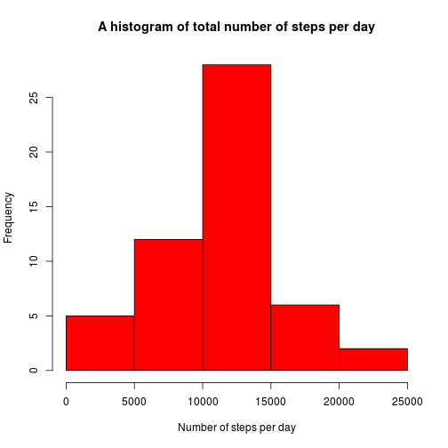
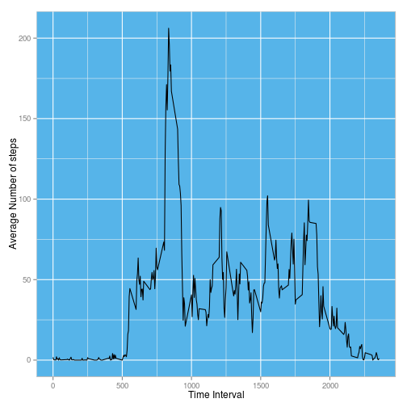
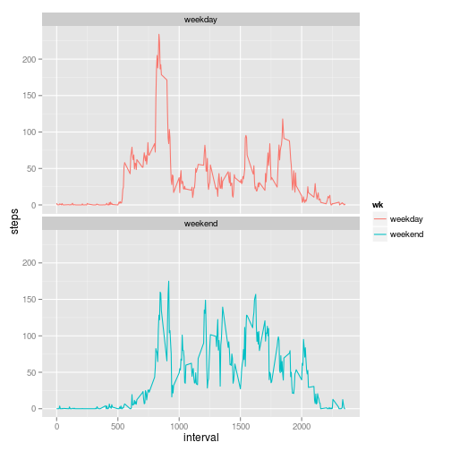

>**By**:*Dr.Saud Zabin,MD.*

>**Email**: saud.zabin@gmail.com.

>**Feel Free To Contact**


Reproducible Research Assignment 1
========================================================

### Loading and preprocessing the data


```r
library(plyr)
library(ggplot2)
library(timeDate)
acts <- read.csv("activity.csv", colClasses="character")
acts$steps <- as.numeric(acts$steps,na.rm=TRUE)
act <- acts[which(acts$steps != "NA"), ]
```

### A histogram of the total number of steps taken each day.

```r
sum_steps <- ddply(act,.(date),summarise,steps=sum(steps))
hist(sum_steps$steps,col="red",xlab="Number of steps per day",main="A histogram of total number of steps per day")
```

 

### Mean and median total number of steps taken per day.


```r
 mean(sum_steps$steps)
```

```
## [1] 10766
```

```r
 median(sum_steps$steps)
```

```
## [1] 10765
```
The mean is 10766 steps and the median is 10765 steps.

### A time series plot of the average daily activity pattern in 5-min interval .
Using _ggplot2_ plotting system.


```r
interval_steps <- ddply(act,.(interval),summarise,avg.steps=mean(steps))
interval_steps$interval <- as.numeric(interval_steps$interval)
ggplot(data=interval_steps, aes(x=interval, y=avg.steps, group=1)) +
  geom_line(colour="black", size=0.5, shape=21, fill="green") +
  theme(panel.background = element_rect(fill = "#56B4E9", colour = 'gray'))+scale_x_continuous(name="Time Interval") +scale_y_continuous(name="Average Number of steps")
```

 

### Maximum number of steps of 5-min interval across all days.


```r
m.steps<-max(interval_steps$avg.steps)
interval_steps[interval_steps$avg.steps==m.steps,]
```

```
##     interval avg.steps
## 272     2235     206.2
```

### Total numbers of NA's 

```r
sum(is.na(acts$steps==TRUE))
```

```
## [1] 2304
```


### Replacing NA's withe 5-min interval average and new data set created .


```r
merged <- arrange(join(act, interval_steps), interval)
```

```
## Joining by: interval
```

```r
merged$steps[is.na(merged$steps)] <- merged$interval_steps[is.na(merged$steps)]
```

### A histogram of the total number of steps taken each day 

```r
sum_merged <- ddply(merged,.(date),summarise,steps=sum(steps))
hist(sum_merged$steps,col="red",xlab="Number of step per day",main="A histogram of total number of steps per day")
```

 

The new histogram is almost identical to the one in the first part of this report.

### Mean and median of total number of steps taken each day.


```r
mean(sum_merged$steps)
```

```
## [1] 10766
```

```r
median(sum_merged$steps)
```

```
## [1] 10765
```
we can see that there is no impact of replacing the NA's on the the mean nor the median.

### A comparison in activity patterns between weekdays and weekends.

#### Creating a new factor variable in the dataset with two levels – “weekday” and “weekend” indicating whether a given date is a weekday or weekend day.
> Note: Beacuse of that our system is Arabic language by defualt the week days appeared in arabic,so we used the arabic characters during classifying days("sunday"="الأحد","Satarday"="السبت")


```r
weekdays <- weekdays(as.Date(merged$date))
data_with_weekdays <- transform(merged, day=weekdays)
data_with_weekdays$wk <- ifelse(data_with_weekdays$day %in% c("السبت", "الأحد"),"weekend", "weekday")
average_by_interval_wk <- ddply(data_with_weekdays, .(interval, wk), summarise, steps=mean(steps))
average_by_interval_wk$interval <- as.numeric(average_by_interval_wk$interval)
average_by_interval_wk$interval <-average_by_interval_wk$interval
```

### Plotting the comparison using _ggplot2_ graphical system.

```r
ggplot(data=average_by_interval_wk, aes(x=interval, y=steps, group=wk)) + geom_line(aes(color=wk))+ facet_wrap(~ wk, nrow=2)
```

 

