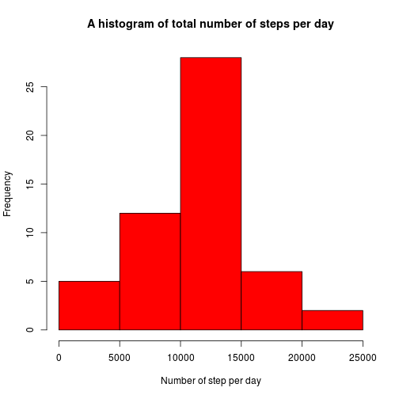

Your car : Automatic or Manual does matter!
========================================================
Executive summary
---------------------
Which is better manual or automatic transmission in cars?,can we quantify the diffrence?
we found by using __*t.test__ and after building a __*regression model*__  that manual transmission is better than automatic in term of mile per galon travel by 2.9 miles.
### Is an automatic or manual transmission better for MPG? 
First we did some exploratory ploting *(see Appendix Figure 1,2)*

#### Inference
we used T.test to compair  means of manual and automatic transmissions.

-converting some variables to factors:


```r
mtcars$cyl <- as.factor(mtcars$cyl)
mtcars$vs <- as.factor(mtcars$vs)
mtcars$gear <- as.factor(mtcars$gear)
mtcars$carb <- as.factor(mtcars$carb)
mtcars$am <- as.factor(mtcars$am)
```


```r
t.test(mpg ~ am ,mtcars)
```

```
## 
## 	Welch Two Sample t-test
## 
## data:  mpg by am
## t = -3.767, df = 18.33, p-value = 0.001374
## alternative hypothesis: true difference in means is not equal to 0
## 95 percent confidence interval:
##  -11.28  -3.21
## sample estimates:
## mean in group 0 mean in group 1 
##           17.15           24.39
```

As we can see __*t.test*__ rejected the null hypthesis, which is that there is no diffrence between atumatic and manual transmission with p-value = 0.001374,that's mean that there is a signifcant difference between the mean of manual and automatic transmission .


### Quantifing the MPG difference between automatic and manual transmissions.

#### Regression
 we used __*Bayesian Information Criteria (BIC)*__ algorithm to select model,as below:


```r
all <- lm(mpg ~ ., data = mtcars)
n <- nrow(mtcars)
lm1 <- step(all, direction = "backward", k = log(n))
```


```r
summary(lm1)
```

```
## 
## Call:
## lm(formula = mpg ~ wt + qsec + am, data = mtcars)
## 
## Residuals:
##    Min     1Q Median     3Q    Max 
## -3.481 -1.556 -0.726  1.411  4.661 
## 
## Coefficients:
##             Estimate Std. Error t value Pr(>|t|)    
## (Intercept)    9.618      6.960    1.38  0.17792    
## wt            -3.917      0.711   -5.51    7e-06 ***
## qsec           1.226      0.289    4.25  0.00022 ***
## am1            2.936      1.411    2.08  0.04672 *  
## ---
## Signif. codes:  0 '***' 0.001 '**' 0.01 '*' 0.05 '.' 0.1 ' ' 1
## 
## Residual standard error: 2.46 on 28 degrees of freedom
## Multiple R-squared:  0.85,	Adjusted R-squared:  0.834 
## F-statistic: 52.7 on 3 and 28 DF,  p-value: 1.21e-11
```

We can see here that there is three factors affecting the MPG signifcantly which are "wt","qsec" and "am1".
In conclusion the manual transmission car will travel 2.9 miles per galon more than automated one(if the "wt"and "qsec" variables remained constant)

### Redisdual and diagnostics

#### Residuals

Residual vs. Model plot showed randomly scatterd points which support our assumption.*(see Appendix Figure 3)*

#### Laverage

We calculated the laverage for the dataset to find outliers.


```r
lg <- hatvalues(lm1)
```


```r
lg[which(lg > 0.5)]
```

```
## named numeric(0)
```


### Appendix

__Figure 1__

```r
plot(as.factor(mtcars$am),mtcars$mpg)
```

 

__Figure 2__

```r
pairs(mtcars, panel = panel.smooth,main = "Pairs graph for MTCars")
```

 

__Figure 3__

```r
rsd<-resid(lm1)
plot(fitted(lm1),rsd,xlab ="Fitted Values", ylab = "Residuals")
abline(h=0, lty=2,col="green")
lines(smooth.spline(fitted(lm1), rsd),col="red")
```

 


